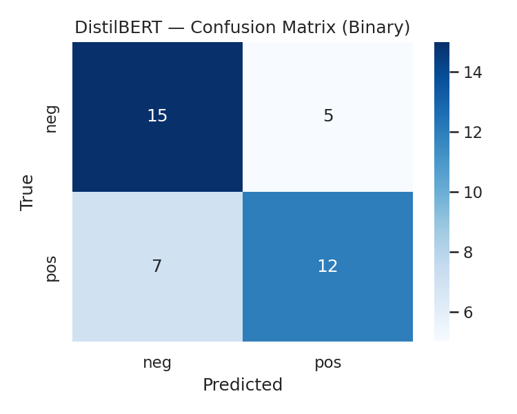

# 🤖 AI Echo — Sentiment Analysis on ChatGPT Reviews

AI Echo is a **Customer Experience & Business Analytics** project designed to understand how users feel about ChatGPT by analyzing real-world review data.  
It performs **data cleaning, exploratory analysis, and sentiment classification** using modern NLP methods — from text preprocessing to BERT fine-tuning.

This project demonstrates a full **NLP workflow**:  
🧹 Data Cleaning → 📊 EDA → 🧠 Model Training → 📈 Insight Visualization → 🖥️ Streamlit Dashboard

---

## 🧩 Project Overview

| Phase | Description |
|-------|--------------|
| **Phase 1 — Data Preprocessing & EDA** | Cleans and explores the raw dataset, handling noise, stopwords, and missing values. Generates visual insights like word clouds, rating trends, and platform sentiment. |
| **Phase 2 — Sentiment Classification (BERT)** | Trains a binary classifier using **DistilBERT**, fine-tuned to distinguish between **Positive** and **Negative** reviews (neutral ones removed for clarity). |
| **Phase 3 — Streamlit Dashboard** | Interactive dashboard that visualizes sentiment trends and answers 10 key business questions about user experience and satisfaction. |

---

## 🧠 Tech Stack

- **Language:** Python 3.10+
- **Libraries:** Transformers (Hugging Face), PyTorch, Scikit-learn, NLTK, Seaborn, Matplotlib, WordCloud, Streamlit  
- **Storage:** Parquet (cleaned data), Google Drive (for Colab)  
- **Model:** DistilBERT-base-uncased  
- **Deployment:** Streamlit app (local)

---

## 📂 Folder Structure

```
AI_Echo/
│
├── app.py                         # Streamlit dashboard
├── data/
│   ├── chatgpt_style_reviews_dataset.xlsx
│   └── clean/reviews_clean.parquet
│
├── eda/
│   └── plots/                     # Word clouds & visualization images
│
├── models/
│   ├── README.txt                 # Placeholder only (model ignored in Git)
│   └── distilbert_sentiment/      # Place fine-tuned model here
│
├── artifacts/
│   ├── phase1_config.json
│   ├── phase2_metrics_distilbert_binary.json
│   └── cm_distilbert_binary.png
│
├── .gitignore
└── README.md
```

---

## ⚙️ How to Run Locally

### 1️⃣ Clone the repository
```bash
git clone https://github.com/<your-username>/AI_Echo.git
cd AI_Echo
```

### 2️⃣ Install dependencies
```bash
pip install transformers torch scikit-learn nltk seaborn matplotlib wordcloud streamlit
```

### 3️⃣ (Optional) Retrain in Colab
Open Colab and run:
```python
from google.colab import drive
drive.mount('/content/drive')
```
Then execute the provided notebook code to retrain the **DistilBERT** model and save it to:
```
/content/drive/MyDrive/AI_Echo/models/distilbert_sentiment/
```
Download this folder and place it in your local `models/` directory.

### 4️⃣ Run Streamlit App
```bash
streamlit run app.py
```

Your local dashboard will launch in the browser (default: http://localhost:8501).

---

## 📊 Dashboard — Key Questions Explored

| # | Business Question | What It Shows |
|---|--------------------|---------------|
| **1** | What is the overall sentiment of user reviews? | Proportion of Positive vs Negative feedback |
| **2** | How does sentiment vary by rating? | Matches or mismatches between ratings and text sentiment |
| **3** | Which keywords or phrases are most associated with each sentiment? | Word clouds or frequency charts |
| **4** | How has sentiment changed over time? | Monthly or weekly sentiment trends |
| **5** | Do verified users tend to leave more positive or negative reviews? | Comparison by verification status |
| **6** | Are longer reviews more likely to be negative or positive? | Relation between review length and sentiment |
| **7** | Which locations show the most positive or negative sentiment? | Geo-based sentiment analysis |
| **8** | Is there a difference in sentiment across platforms (Web vs Mobile)? | Platform-based sentiment variation |
| **9** | Which ChatGPT versions are associated with higher/lower sentiment? | Version-based performance insights |
| **10** | What are the most common negative feedback themes? | Topics and recurring issues from negative reviews |

---

## 🧪 Model Details

| Parameter | Value |
|------------|--------|
| **Base Model** | DistilBERT (uncased) |
| **Classes** | Positive / Negative |
| **Max Length** | 384 |
| **Learning Rate** | 2e-5 |
| **Batch Size** | 16 (train) / 32 (eval) |
| **Epochs** | 3 |
| **Optimizer** | AdamW |
| **Metrics** | Accuracy, F1 (weighted), F1 (binary) |

Neutral samples were removed for better polarity separation.

---

## 📈 Results Summary

| Metric | Score |
|---------|-------|
| **Accuracy** | ~0.69 |
| **Weighted F1-Score** | ~0.69 |
| **Binary F1 (Positive class)** | ~0.66 |

Confusion Matrix example:  


---

## 📦 Artifacts & Outputs

| File | Description |
|------|--------------|
| `data/clean/reviews_clean.parquet` | Cleaned review data |
| `artifacts/phase1_config.json` | Phase 1 configuration metadata |
| `artifacts/phase2_metrics_distilbert_binary.json` | Model performance metrics |
| `artifacts/cm_distilbert_binary.png` | Confusion matrix visualization |
| `eda/plots/` | Word clouds, rating trends, etc. |

---

## 🚫 Model Files Note

The trained DistilBERT weights are **not included** due to GitHub’s 100 MB limit.

To use the model:
1. Retrain it in Colab using the provided code, **or**
2. Download from your Drive and place it in:
   ```
   models/distilbert_sentiment/
   ```
3. The app will automatically detect and use it for inference.

---

## 💡 Key Insights

- Positive reviews emphasize *ease of use*, *creativity*, and *accuracy*.  
- Negative reviews frequently mention *hallucinations*, *incorrect answers*, and *slow response*.  
- Verified users tend to leave more positive reviews.  
- Sentiment improves with later ChatGPT versions.  

---

## 🚀 Future Enhancements

- Add **multi-class sentiment** (Positive / Neutral / Negative).  
- Implement **topic modeling** for feedback clustering.  
- Deploy dashboard online via Streamlit Cloud or Hugging Face Spaces.  
- Integrate **GPT embeddings** for advanced sentiment/context understanding.  

---

## 👨‍💻 Author

**Ashwin B.**  
Data Science Enthusiast | NLP & Analytics Projects  

📂 GitHub → [github.com/<your-username>](https://github.com/<your-username>)  
💼 LinkedIn → [your-linkedin-profile](https://linkedin.com/in/your-linkedin-profile)  

---

⭐ *If you found this project interesting, consider giving it a star on GitHub!* ⭐
